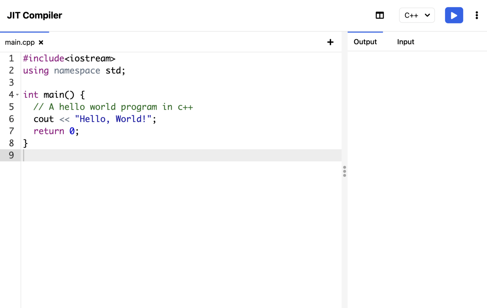

## JITCompiler

JIT Compiler is a online code compiler for students and developer's.
You can run more than 40+ most popular programming languages in your browser just-in-time using jitcompiler.

Our online compiler has a user friendly text editor with live auto-suggestion and syntax highlighting features.
You can write compile and run your code in single click in your browser even in your phone using jitcompiler.

## Features

<br>
<div align="center">
  
</div>
<br>

JIT Compiler provide lots of amazing features:
- Free online compiler.
- Almost every popular programming language support.
- Easy and clean UI with dark mode.
- Automatically save your last executed code on your browser.
- Press CTRL+ENTER to execute your code.
- Download your source code.
- Create multiple files.

## Installation (Linux)

Open your terminal and run following command:
#### Clone the github repository
```bash
git clone https://github.com/rajkumardusad/jitcompiler
```
#### Run the project setup file
```bash
cd jitcompiler && chmod +x setup.sh && ./setup.sh
```
#### Run the project
```bash
npm start
```

It will start server at http://localhost:3000

## Our Tech Stack
We have used the best tools to build jitompiler.com
- ExpressJs (Node Js)
- Docker
- Ace Editor
- Tailwind CSS
- PWA
